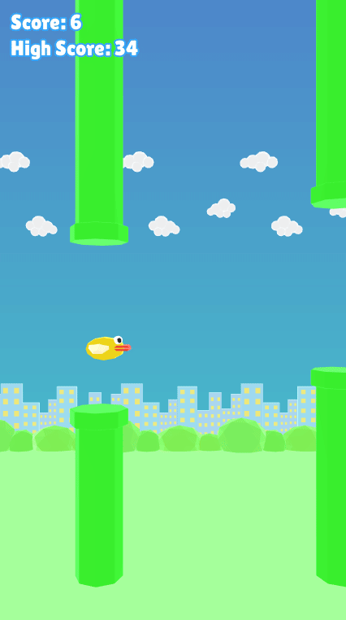

<h1 align="center">Flappy Bird 3D Game</h1>

<p align="center">
  <a href="https://rzrabbi.itch.io/flappy-bird-3d" target="_blank">
    
  </a>
</p>

<p align="center">
  This is my very first game development project! I've always wanted to explore game dev, and I chose Godot as my first engine to learn the ropes. Flappy Bird 3D is my first attempt at building something playable, learning how game programming works, and getting comfortable with Godot. It's a simple, classic game where you try to fly a bird through endless pipes, but making it in 3D was a fun challenge for my first project.
</p>

<h2 align="center">Gameplay Preview</h2>

<p align="center">
  <a href="https://rzrabbi.itch.io/flappy-bird-3d">
    
  </a>
</p>

# How to play

The game is controlled using the **Spacebar** on a keyboard. If you are playing on a touchscreen device, you can simply **tap the screen** to jump and navigate the bird through the pipes.

# Running from Source

If you want to modify or edit the source code, you can easily set it up locally. (If you just want to play the game, you can play it directly in your browser on [itch.io](https://rzrabbi.itch.io/flappy-bird-3d)).

### Prerequisites
You will need **Godot Engine 3.x** (version 3.6 recommended). You can download it for free from [the official Godot website](https://godotengine.org/download/archive/3.6-stable/).

### Steps to Run Locally

1. **Clone the repository**:
   ```bash
   git clone https://github.com/rzrabbi/flappy-bird-3d.git
   ```
2. **Import the project**:
   - Open **Godot Engine**.
   - Click the **Import** button on the right side.
   - Click **Browse** and navigate to your cloned `flappy-bird-3d` folder.
   - Select the `project.godot` file, click **Open**, and then click **Import & Edit**.
3. **Run the game**:
   - Once inside the editor, click the **Play** button in the top-right corner (or press `F5`) to start playing!


# Special Thanks

A massive thank you to **Johnny Rouddro** for introducing me to the Godot Engine and game development in general. His guidance in setting up the project and helping write the code was invaluable to this first step of my journey.

Many thanks as well to **Borna Barua** for creating the fantastic 3D art and assets for this game.
